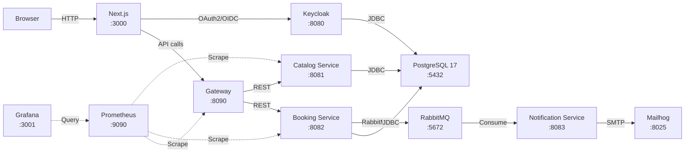

# Passly


Sistema de reserva de tickets para eventos, construido como proyecto de portfolio para demostrar arquitectura de microservicios, testing a todos los niveles y CI/CD real.

Un usuario se registra e inicia sesión (Keycloak), navega el catálogo de eventos, reserva un ticket y lo recibe por email.

---

## Arquitectura



### Servicios

| Servicio | Puerto | Descripción |
| --- | --- | --- |
| **Gateway** | 8090 | Spring Cloud Gateway — enrutamiento y propagación JWT |
| **Catalog Service** | 8081 | CRUD de eventos, publicación de eventos al catálogo |
| **Booking Service** | 8082 | Reservas, control de concurrencia (optimistic locking + idempotencia) |
| **Notification Service** | 8083 | Envío de tickets por email |

### Patrones arquitectónicos

- **Arquitectura hexagonal** (ports & adapters) en todos los servicios Spring Boot
- **Database-per-service** — cada servicio tiene su propia base de datos PostgreSQL
- **Outbox pattern** — consistencia transaccional entre reserva y notificación vía RabbitMQ
- **Comunicación asíncrona** — RabbitMQ como único bus inter-servicio (ADR-0005)
- **Sincronización catálogo → booking** — vía eventos RabbitMQ (ADR-0011)

---

## Stack Tecnológico

| Capa | Tecnología | Versión |
| --- | --- | --- |
| **Runtime Backend** | OpenJDK | 25 |
| **Framework Backend** | Spring Boot | 4.1.0 |
| **API Gateway** | Spring Cloud Gateway | — |
| **Runtime Frontend** | Node.js | 22 |
| **Framework Frontend** | Next.js | 16.3.0 |
| **UI Components** | shadcn/ui + Tailwind CSS | 4.x |
| **Auth** | NextAuth v5 (beta) + Keycloak | 26.7 |
| **Base de datos** | PostgreSQL | 17 |
| **Message Broker** | RabbitMQ | 4.3.4 |
| **Testing Unit/Integration** | JUnit 5 + Testcontainers | — |
| **Testing E2E** | Playwright | 1.62+ |
| **Testing Load** | k6 | — |
| **CI/CD** | GitHub Actions | — |
| **Observabilidad** | Prometheus + Grafana | 2.55 / 11.6 |
| **Containerización** | Docker Compose | — |

---

## Quick Start

### Requisitos previos

- Docker y Docker Compose v2
- 4 GB de RAM libre (para los contenedores)

### Arranque

```bash
# Desde la raíz del repo — un solo comando
docker compose up -d
```

Esto levanta el núcleo del sistema:

| Servicio | URL |
| --- | --- |
| Frontend | http://localhost:3000 |
| Gateway API | http://localhost:8090 |
| Keycloak | http://localhost:8080 |
| Catalog Service | http://localhost:8081 |

### Verificar el entorno

```bash
bash scripts/smoke.sh
```

Ejecuta 15 verificaciones de salud contra los contenedores levantados.

### Credenciales de prueba

| Usuario | Contraseña | Rol |
| --- | --- | --- |
| admin | admin123 | ADMIN |

### Profile de mensajería (completo)

Para levantar el stack completo con RabbitMQ, Booking y Notification:

```bash
docker compose -f infra/docker-compose.yml -f infra/docker-compose.messaging.yml \
  --profile messaging up -d
```

### Profile de observabilidad

Para agregar Prometheus y Grafana:

```bash
docker compose -f infra/docker-compose.yml -f infra/docker-compose.messaging.yml \
  --profile messaging --profile observability up -d
```

| Servicio | URL |
| --- | --- |
| RabbitMQ Management | http://localhost:15672 |
| Mailhog (SMTP dev) | http://localhost:8025 |
| Prometheus | http://localhost:9090 |
| Grafana | http://localhost:3001 |

---

## Testing

### Smoke tests

```bash
bash scripts/smoke.sh
```

15 verificaciones: salud de contenedores, bases de datos, realm de Keycloak, autenticación, routing del gateway y servicios opcionales.

### E2E (Playwright)

```bash
cd apps/web
npx playwright install --with-deps chromium
npx playwright test
```

Tests de extremo a extremo contra el stack completo: autenticación, exploración de eventos y reserva.

### Load tests (k6)

```bash
# Sembrar datos de prueba
bash tests/k6/seed.sh

# Benchmark — 100 RPS sostenidos
k6 run tests/k6/benchmark.js

# Spike — tráfico 10x repentino
k6 run tests/k6/spike.js

# Concorrencia — 100 usuarios compitiendo por últimos tickets
k6 run tests/k6/concurrency.js

# Soak — carga sostenida 5 minutos
k6 run tests/k6/soak.js
```

### Unit / Integration

```bash
cd services/catalog-service
./mvnw verify

cd services/booking-service
./mvnw verify

cd services/notification-service
./mvnw verify

cd services/gateway
./mvnw verify
```

JUnit 5 + Mockito para unit tests. Spring Boot Test + Testcontainers para integración con PostgreSQL y RabbitMQ.

---

## Resultados de Carga

Resultados obtenidos del entorno QA efímero (GitHub Actions):

| Escenario | Objetivo | Resultado | p95 | Requests | Estado |
| --- | --- | --- | --- | --- | --- |
| **Benchmark** | 100 RPS sostenidos | 84.2 RPS | 5.9 ms | 15,149 | PASS |
| **Spike** | 10x tráfico repentino | 49.4 RPS | 4.2 ms | 3,949 | PASS |
| **Concorrencia** | 100 VUs, últimos tickets | 28 OK / 72 conflictos | 276 ms | 100 | PASS |

- Todos los checks HTTP pasaron (status 201 o 409, cero errores inesperados)
- Latencia p95 bajo 300ms en todos los escenarios
- El escenario de concurrencia demostra que el optimistic locking funciona correctamente: de 100 usuarios simultáneos, 28 obtienen ticket y 72 reciben conflict (409) — sin corrupción de datos

Reporte HTML interactivo con gráficos: [artifacts/k6/report.html](artifacts/k6/report.html)

---

## Estructura del Repo

```
Passly/
├── apps/
│   └── web/                    # Next.js 16 — Frontend
│       ├── src/app/            # App Router (páginas)
│       ├── src/components/     # Componentes UI (shadcn/ui)
│       ├── src/features/       # Features (admin, events, reservations)
│       ├── src/lib/            # API clients (catalog, booking)
│       └── e2e/                # Tests Playwright
├── services/
│   ├── catalog-service/        # CRUD de eventos (Spring Boot)
│   ├── booking-service/        # Reservas y tickets (Spring Boot)
│   ├── notification-service/   # Envío de emails (Spring Boot)
│   └── gateway/                # API Gateway (Spring Cloud Gateway)
├── infra/
│   ├── docker-compose.yml      # Stack principal
│   ├── docker-compose.messaging.yml  # Overlay de mensajería
│   ├── keycloak/               # Realm export
│   ├── postgres/               # Init scripts
│   ├── grafana/                # Dashboards provisionados
│   └── prometheus/             # Config de scraping
├── tests/
│   └── k6/                     # Scripts de load testing
├── scripts/
│   ├── smoke.sh                # Smoke tests (bash)
│   └── smoke.ps1               # Smoke tests (PowerShell)
├── artifacts/
│   └── k6/                     # Reportes de load testing
├── docs/
│   ├── adr/                    # Architecture Decision Records
│   └── ROADMAP.md              # Roadmap del proyecto
├── compose.yaml                # Punto de entrada (incluye infra/)
├── CONTEXT.md                  # Glosario del dominio
└── AGENTS.md                   # Configuración de agentes
```

---

## Decisiones Arquitectónicas

La spec completa del proyecto está en [#1](https://github.com/Ainsiel/Passly/issues/1). Todas las decisiones de diseño están documentadas como ADRs (Architecture Decision Records) en [`docs/adr/`](docs/adr/):

| ADR | Decisión |
| --- | --- |
| [ADR-0001](docs/adr/0001-microservices-bounded-contexts.md) | Microservicios con bounded contexts |
| [ADR-0002](docs/adr/0002-database-per-service.md) | Database-per-service |
| [ADR-0003](docs/adr/0003-optimistic-locking-reservation.md) | Optimistic locking + idempotencia en reservas |
| [ADR-0004](docs/adr/0004-outbox-pattern.md) | Outbox pattern con poller y RabbitMQ |
| [ADR-0005](docs/adr/0005-rabbitmq-only-inter-service.md) | RabbitMQ como único bus inter-servicio |
| [ADR-0006](docs/adr/0006-keycloak-identity-provider.md) | Keycloak como proveedor de identidad |
| [ADR-0007](docs/adr/0007-monorepo-no-workspaces.md) | Monorepo sin tooling de workspaces |
| [ADR-0008](docs/adr/0008-ephemeral-qa-env.md) | Entorno QA efímero en GitHub Actions |
| [ADR-0009](docs/adr/0009-observability-oss-only.md) | Observabilidad 100% open source |
| [ADR-0010](docs/adr/0010-email-ticket-no-pdf.md) | Ticket por email HTML con QR, sin PDF |
| [ADR-0011](docs/adr/0011-catalog-booking-sync.md) | Sincronización catálogo → booking por RabbitMQ |
| [ADR-0012](docs/adr/0012-ticket-email-outbox-notifications.md) | Ticket por email: outbox booking → notification |
| [ADR-0013](docs/adr/0013-ci-quality-gate.md) | CI Quality Gate |
